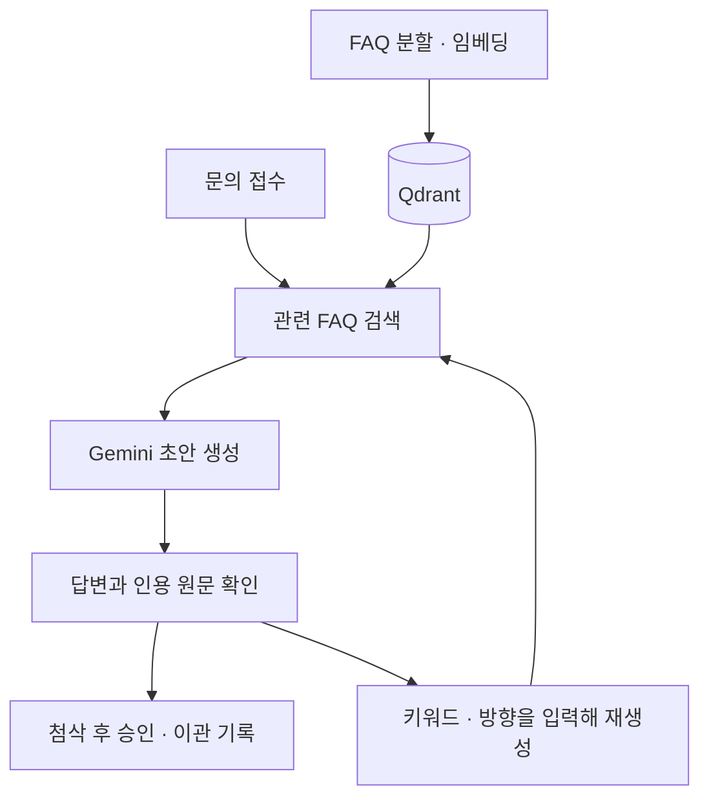

# 문의데스크 · Inquiry Desk

의류 쇼핑몰 문의에 답변 초안을 작성하는 상담 앱입니다. AI가 FAQ와 주문 정보를 참고해 초안을 만들면, 상담원이 근거를 확인하고 답변을 다듬습니다.

가상 쇼핑몰의 FAQ 10개, 주문 6건, 문의 8건을 담은 로컬 데모입니다. 승인·이관 결과는 앱에 기록합니다.

## 작동 방식



문의가 들어오면 서버가 순서대로 초안을 작성합니다. 상담원 화면에는 문의 목록, 주문 정보와 답변, FAQ 근거를 나란히 배치했습니다. AI는 문의를 답변 가능·추가 확인·이관 제안으로 분류합니다.

답변은 직접 수정할 수 있습니다. 재생성할 때 “결론 먼저”, “배송비를 구분해서 설명”처럼 방향을 입력하면 현재 편집 내용도 함께 참고합니다. 새 답변을 받으면 편집 내용을 교체하고, 생성에 실패하면 기존 내용을 유지합니다.

FAQ를 수정한 뒤에는 검색 색인을 갱신합니다. 서버는 문서 버전과 문의 수정 이력을 검사해 이전 정책의 초안 승인이나 동시 수정 충돌을 막습니다. 자동 작성 중 실패한 문의는 개별 재시도가 가능합니다.

## 실행

Python 3.11 이상, uv, Node.js 22.12 이상과 npm이 필요합니다.

```sh
git clone https://github.com/uckdo/inquiry-desk.git
cd inquiry-desk
uv sync --frozen
npm --prefix frontend ci
npm --prefix frontend run build
uv run uvicorn desk.main:create_app --factory --host 127.0.0.1 --port 8770
```

[http://127.0.0.1:8770](http://127.0.0.1:8770/)에 접속한 뒤 다음 순서로 시작합니다.

1. **설정**에서 Gemini API 키를 저장합니다.
2. **FAQ 자료**에서 **검색 색인 만들기**를 누릅니다.
3. **문의함**에서 자동으로 작성된 초안과 근거를 확인합니다.

색인과 답변 생성에는 Gemini API를 사용하며, 사용량에 따라 비용이 발생할 수 있습니다.

키는 `data/clothing/gemini-key`에 평문으로 저장합니다. 키 파일이 없으면 `GEMINI_API_KEY` 환경변수를 사용합니다. 문의·FAQ·처리 이력과 벡터 색인은 `data/clothing/`에 보관합니다.

## 기술 구성

| 구성 | 용도 |
| --- | --- |
| React · Vite | 상담원 화면 |
| Python · FastAPI · Pydantic | REST API와 입력 검증 |
| SQLite | 문의, FAQ, 처리 이력 저장 |
| LangChain | 문서 분할과 검색·생성·검증 연결 |
| Qdrant | 768차원 벡터 저장, 관련 조각 상위 6개 검색 |
| Gemini | `gemini-embedding-001` 임베딩, `gemini-2.5-flash-lite` 답변 생성 |

FAQ를 분할하고 임베딩해 Qdrant에 저장합니다. 질문이 들어오면 관련 조각을 검색해 주문 정보와 함께 Gemini에 전달합니다. 모델이 선택한 문단 번호를 원문 인용으로 연결하고, 검색 결과에 없는 인용은 거절합니다.

```text
desk/       FastAPI, RAG, Gemini 연동, 평가 실행기
frontend/   React 화면
demo/       가상 FAQ·주문·문의와 평가 문항
tests/      API·RAG·자동 작성·브라우저 테스트
```

## 테스트

```sh
uv run pytest -q
uv run python -m desk.evaluate
```

첫 번째 명령은 API·RAG·자동 작성 테스트, 두 번째는 평가 문항 30개의 형식과 참조 검사입니다. 테스트에는 모의 모델 응답을 사용합니다.

- [데모 데이터](demo/README.md)
- [REST API](CONTRACT.md)
