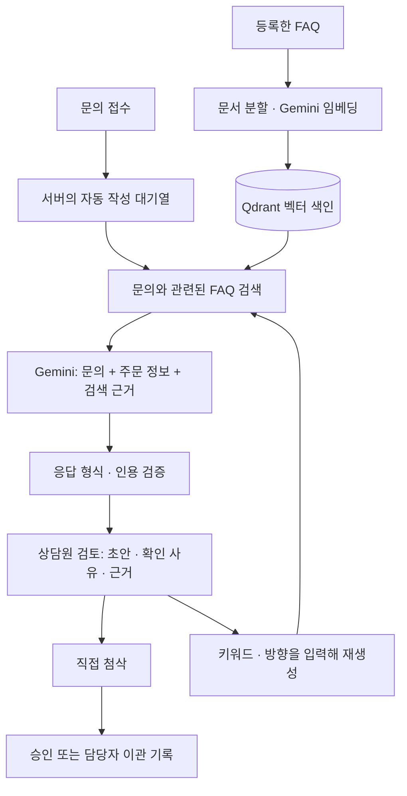

# 문의데스크 · Inquiry Desk

**접수된 문의의 1차 초안을 AI가 작성하고, 상담원이 근거를 확인하며 첨삭하는 의류 쇼핑몰 FAQ 상담 앱입니다.**

배송·교환·반품 질문을 등록하면 서버가 FAQ를 검색하고 주문 정보와 함께 Gemini에 전달합니다. 상담원은 문의, 편집 가능한 초안, 인용 원문을 한 화면에서 비교합니다. 별도의 최초 작성 버튼 없이 처리하며, 원하는 키워드나 표현 방향을 넣어 답변을 다시 생성할 수 있습니다.

고객·주문·FAQ는 모두 가상 데이터입니다. 승인과 이관은 로컬 기록이며 고객에게 답변을 보내거나 실제 주문·결제·환불을 처리하지 않습니다.

## 사용 흐름



1. **문의 접수:** 가상 주문을 선택하고 고객 질문을 입력합니다. 기본 문의 8건도 처음 실행할 때 등록합니다.
2. **자동 1차 작성:** 키와 최신 색인이 준비되면 서버가 미작성 문의를 한 건씩 처리합니다. 화면을 열거나 문의를 선택할 필요가 없습니다.
3. **근거 대조:** 상담원은 왼쪽 문의 목록, 중앙 주문 정보·초안, 오른쪽 FAQ 인용을 비교합니다. 모델 결과는 답변 가능(`answer`), 추가 확인(`clarify`), 이관 제안(`escalate`)으로 구분합니다.
4. **첨삭·재생성:** 초안을 직접 고치거나 재생성 방향에 “결론 먼저, 배송비를 구분해서 설명” 같은 요청을 입력합니다. 서버는 원래 문의로 다시 검색하고 현재 편집 내용과 방향을 모델에 별도로 전달합니다. 성공하면 새 결과로 교체하고, 실패하면 입력 내용을 보존합니다.
5. **검토 결과 기록:** 근거가 있는 답변을 수정한 뒤 승인하거나, 담당자 확인이 필요한 사유를 기록합니다. 추가 확인·이관 제안 결과에는 일반 답변 승인을 허용하지 않습니다.

### 자동 작성 중에는

| 상황 | 처리 |
| --- | --- |
| 키 없음 또는 색인 미생성·변경됨 | 대기 사유를 표시하고 준비될 때까지 기다립니다. |
| 문의 접수·서버 시작·키 저장·색인 완료 | 미작성 문의를 순서대로 처리합니다. |
| 기존 초안이나 승인·이관 기록 있음 | 자동으로 덮어쓰지 않습니다. |
| 생성 실패 | 오류를 남기고, 해당 문의에서 명시적으로 재시도합니다. |
| 서버 중단 당시 생성 중이었음 | 재시작 시 실패로 표시합니다. 비용이 드는 호출을 임의로 반복하지 않습니다. |
| 화면에서 답변이나 폼을 편집 중 | 상태 조회가 편집 내용과 재생성 방향을 덮어쓰지 않습니다. |

추가 확인 결과는 현재 사유와 근거를 보여 주는 방식입니다. 같은 문의에 고객의 후속 답변을 입력해 재분석하는 기능은 아직 없습니다.

## 로컬 실행

Python 3.11 이상, `uv`, Node.js 22.12 이상과 npm이 필요합니다. 아래 명령은 프로젝트 루트에서 실행합니다.

```sh
git clone https://github.com/uckdo/inquiry-desk.git
cd inquiry-desk
uv sync --frozen
npm --prefix frontend ci
npm --prefix frontend run build
uv run uvicorn desk.main:create_app --factory --host 127.0.0.1 --port 8770
```

브라우저에서 [http://127.0.0.1:8770](http://127.0.0.1:8770/)을 엽니다. 별도 Qdrant 서버 없이 로컬 모드로 실행합니다.

1. **설정**에서 본인의 Gemini API 키를 저장합니다. 저장 성공은 키의 유효성이나 사용 한도 검증을 뜻하지 않습니다.
2. **FAQ 자료**에서 기본 FAQ 10개를 확인한 뒤 **검색 색인 만들기**를 누릅니다.
3. 색인이 완성되면 기본 문의의 자동 작성을 시작합니다. **문의함**에서 완료된 결과와 근거를 확인합니다.

**비용 주의:** 색인 생성은 Gemini 임베딩 API를 호출합니다. 키와 최신 색인이 준비되면 대기 중인 문의와 새 문의를 자동 처리하므로, 각각 검색용 임베딩·답변 생성 호출이 발생합니다. 재시도·방향 재생성도 API를 사용합니다. 사용 전 본인 계정의 요금과 한도를 확인하세요.

### 키와 데이터 보관

- 화면에서 저장한 키는 `data/clothing/gemini-key`에 **평문**으로 저장합니다. API 응답이나 브라우저 저장소에는 키를 돌려주지 않습니다. 이 파일을 읽을 수 있는 사람은 키를 사용할 수 있습니다.
- 저장된 키 파일이 없으면 서버 프로세스의 `GEMINI_API_KEY` 환경변수를 사용합니다. `.env` 파일을 자동으로 읽는 기능은 없습니다. 프런트엔드의 `VITE_*` 변수에 키를 넣지 마세요.
- 문의·FAQ·주문 스냅샷·처리 이력은 `data/clothing/desk.sqlite3`, 벡터 색인은 `data/clothing/vectors/`에 저장합니다. 서버를 재시작해도 유지합니다.
- 문의와 검색 근거는 Google Gemini로 전송합니다. 일부 이메일·국내 전화번호 치환은 완전한 개인정보 비식별화가 아니므로 실제 고객 정보나 기밀 문서를 넣지 마세요.

단일 사용자·단일 서버 프로세스의 로컬 앱입니다. 인증·다중 상담원 권한·운영 배포 구성이 없으므로 `--host 0.0.0.0`, 여러 worker, 공용망 공개 실행을 사용하지 마세요.

## 구현 구조

| 구성 | 맡은 역할 |
| --- | --- |
| React · Vite | 문의·답변·근거 검토, 편집, 상태 조회 |
| Python · FastAPI · Pydantic | REST API와 요청 검증 |
| 서버 작업자 · SQLite | 자동 초안 대기열, 문의 revision, FAQ 버전, 처리 이력 |
| LangChain | 텍스트 분할과 검색 → 생성 → 검증의 Runnable 연결 |
| Qdrant 로컬 모드 | 768차원 벡터 저장, 관련 조각 상위 6개 검색 |
| Gemini | `gemini-embedding-001` 임베딩, `gemini-2.5-flash-lite` 답변 생성 |

RAG는 답변을 쓰기 전에 관련 문서를 검색해 모델에 제공하는 방식입니다. 이 프로젝트는 등록된 FAQ를 분할·임베딩해 Qdrant에 저장하고, 문의를 임베딩해 관련 조각을 찾습니다. 모델을 별도로 학습시키거나 인터넷에서 쇼핑몰 정책을 수집하지 않습니다.

**인용 검증:** 모델은 검색 원문의 문단 번호를 선택하고, 서버가 이를 원문 인용으로 연결합니다. 알 수 없는 번호나 검색 조각에 없는 인용은 거절합니다. 이 검사는 출처 연결을 확인하며, 답변의 추론까지 보장하지는 않습니다.

**변경 충돌 방지:** FAQ를 수정하면 문서 지문(fingerprint)이 바뀝니다. 이전 색인으로 새 답변을 만들거나 이전 정책에 근거한 초안을 승인하지 못하도록 검사합니다. 색인을 갱신한 뒤 기존 초안은 상담원이 재생성해야 합니다. 생성·승인 중 문의 revision과 정책 지문이 바뀐 경우도 거절합니다.

정해진 검색·생성·검증 단계로 동작하며, 모델이 스스로 도구를 선택하는 자율 AI Agent는 아닙니다. 외부 Gemini API를 사용하므로 폐쇄망 실행도 지원하지 않습니다.

```text
desk/                      FastAPI, RAG, Gemini 연동, 평가 실행기
frontend/                  React 화면과 Vite 설정
demo/                      가상 FAQ·주문·문의 및 평가 문항
tests/                     API·RAG·자동 작성·브라우저 검사
CONTRACT.md                REST API와 상태 계약
uv.lock                    Python 의존성 잠금
frontend/package-lock.json 프런트엔드 의존성 잠금
```

데모의 주문 6건은 고객별 단일 상품 스냅샷입니다. 주문·수령 경과일은 고정된 샘플 값이며 재고·택배 위치·환불 상태를 조회하지 않습니다. 필드와 FAQ 기준은 [데모 데이터 안내](demo/README.md), API는 [CONTRACT.md](CONTRACT.md)를 참고하세요.

## 검사와 확인 범위

```sh
uv run pytest -q
uv run python -m desk.evaluate
```

- **자동 테스트:** 2026-09-22 기준 104개 통과. API 입력, 인용, 정책 변경, 동시 처리, 자동 작성·실패 재시도 관련 서버 동작을 검사합니다. 모델 응답은 대체물이므로 실제 답변 정확도 점수가 아닙니다.
- **평가 데이터:** 두 번째 명령은 30문항의 형식과 참조만 확인합니다. 외부 API를 호출하지 않습니다.
- **브라우저:** 자동 1차 작성, 새 문의, 실패 재시도, 첨삭 보존, 방향 재생성, 승인, 재접속, 문서 변경 차단을 별도 모의 서버에서 확인했습니다. 1536×1024와 390×844는 브라우저 뷰포트이며 실제 모바일 기기 검사와 다릅니다.
- **실제 Gemini:** 미작성 문의 5건의 자동 처리를 확인했고 기존 초안 3건의 내용·revision·이력 수를 보존했습니다. 승인이나 외부 발송은 하지 않았습니다. 호출 원문과 화면 캡처는 로컬 검증 자료로 보관하며 이 저장소에는 포함하지 않습니다.

### 브라우저 검사 재실행

위 로컬 앱을 8770에서 실행한 상태에서 별도 터미널로 모의 서버를 시작합니다.

```sh
uv run python -m tests.browser_server
```

검사 실행에는 설치된 Google Chrome과 Node.js용 `playwright` 모듈이 필요합니다. Playwright는 앱 실행 의존성에 포함하지 않습니다. Windows에서는 별도 검사 도구 폴더에 설치한 뒤 모듈 경로를 지정할 수 있습니다.

```powershell
$taskTools = Join-Path $env:TEMP "inquiry-desk-test-tools"
npm install --prefix $taskTools --no-audit --no-fund playwright
$env:PLAYWRIGHT_PATH = Join-Path $taskTools "node_modules/playwright"
node tests/browser_check.cjs
```

검사는 8770 앱을 읽기만 하고 8771 임시 서버에서 접수·편집·승인을 수행합니다. 모의 서버는 실제 키나 Gemini를 사용하지 않습니다. 캡처는 Git에서 제외한 `.impeccable/review/`에 저장합니다.

### 실제 모델 평가와 남은 한계

유료 호출을 포함한 평가는 `--live`를 명시해야 합니다. 다음은 한 사례만 평가하고 새 보고서에 기록하는 명령입니다.

```sh
uv run python -m desk.evaluate --live --key-file data/clothing/gemini-key --case eval-01 --report evaluation-first.json
```

전체 평가에는 `--case`를 생략합니다. 기존 보고서는 덮어쓰지 않습니다. Windows에서 전체 평가 종료 시 임시 Qdrant 파일 잠금으로 정리가 실패한 문제가 남아 있으므로, 전체 30문항의 실모델 평가 완료나 합격률을 주장하지 않습니다.

실제 답변에는 개별 교환·반품 조건을 묻지 않고 일반 절차를 안내하거나, 주문 내부 코드를 노출하고, 재생성 문장 수 지시를 어긴 사례가 있습니다. 출처가 붙은 초안도 상담원이 내용과 조건을 확인해야 합니다. 후속 고객 답변 입력, 초안별 전문 복원, 실제 주문 연동은 아직 구현하지 않았습니다.

## GitHub에 포함하는 파일

소스, 가상 데모 JSON, 테스트, 실행 설정과 두 의존성 잠금 파일을 포함합니다. [.gitignore](.gitignore)에서 다음 항목을 제외합니다.

- **키·자격 증명:** `.env`와 변형 파일, `gemini-key*`, 인증서·개인키, 로컬 인증 설정. 빈 예시용 `.env.example`만 예외이며 현재 앱이 이 파일을 읽지는 않습니다.
- **실행 기록:** `data/`, SQLite DB 및 WAL·SHM 파일, Qdrant 데이터. 실제 문의·고객·생성 답변을 소스와 섞지 않습니다.
- **재생성 가능한 파일:** `.venv/`, `node_modules/`, 빌드 결과, Python·테스트 캐시.
- **로컬 작업 결과:** 모델 호출 보고서, 로그, 브라우저 캡처, 내부 작업·검토 노트, 편집기 설정.

`demo/*.json`, `uv.lock`, `frontend/package-lock.json`은 실행 재현에 필요하므로 제외하지 않습니다. 키가 이미 커밋이나 공개 메시지에 노출됐다면 `.gitignore` 추가로 회수할 수 없습니다. 해당 키를 폐기·재발급하고 추적 이력도 별도로 점검해야 합니다.
