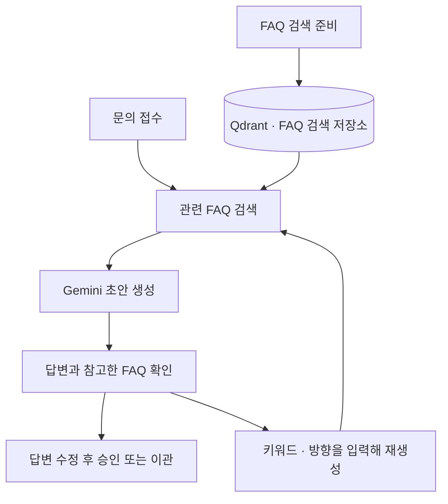

# 문의데스크 · Inquiry Desk

의류 쇼핑몰 문의에 답변 초안을 작성하는 상담 앱입니다. AI가 자주 묻는 질문(FAQ)과 주문 정보를 참고해 초안을 만들면, 상담원이 참고한 내용을 확인하고 답변을 다듬습니다.

가상 쇼핑몰의 FAQ 10개, 주문 6건, 문의 8건으로 내 PC에서 실행해 볼 수 있습니다.

## 작동 방식



문의가 들어오면 별도로 생성 버튼을 누르지 않아도 AI가 순서대로 초안을 작성합니다. 상담원은 한 화면에서 문의, 주문 정보, 답변 초안과 참고한 FAQ를 확인합니다. AI는 바로 답변할 수 있는 문의, 추가 정보가 필요한 문의, 담당자 확인이 필요한 문의로 나눕니다.

답변은 직접 수정할 수 있습니다. 재생성할 때 “결론 먼저”, “배송비를 구분해서 설명”처럼 방향을 입력하면 현재 편집 내용도 함께 참고합니다. 새 답변을 받으면 편집 내용을 교체합니다.

FAQ를 수정한 뒤에는 **검색 색인 만들기**를 눌러 바뀐 내용을 검색에 반영합니다.

## 실행

Python 3.11 이상, uv, Node.js 22.12 이상과 npm이 필요합니다.

```sh
git clone https://github.com/uckdo/inquiry-desk.git
cd inquiry-desk
uv sync --frozen
npm --prefix frontend ci
npm --prefix frontend run build
uv run uvicorn desk.main:create_app --factory --host 127.0.0.1 --port 8770
```

[http://127.0.0.1:8770](http://127.0.0.1:8770/)에 접속한 뒤 다음 순서로 시작합니다.

1. **설정**에서 Gemini API 키를 저장합니다.
2. **FAQ 자료**에서 **검색 색인 만들기**를 눌러 FAQ를 검색할 수 있도록 준비합니다.
3. **문의함**에서 자동으로 작성된 초안과 참고한 FAQ를 확인합니다.

FAQ 검색 준비와 답변 작성에는 Gemini API를 사용하며, 사용량에 따라 비용이 발생할 수 있습니다.

## 기술 구성

| 구성 | 용도 |
| --- | --- |
| React · Vite | 상담원 화면 |
| Python · FastAPI · Pydantic | 문의와 답변을 주고받는 REST API, 입력값 확인 |
| SQLite | 문의, FAQ, 처리 이력 저장 |
| LangChain | FAQ 검색과 답변 작성 과정 연결 |
| Qdrant | 문의와 관련된 FAQ 검색 |
| Gemini | FAQ를 검색용 데이터로 변환하고 답변 초안 작성 |

관련 FAQ를 먼저 찾고 이를 참고해 답변하는 RAG 방식입니다. Qdrant가 문의와 관련된 FAQ를 찾으면, Gemini가 해당 내용과 주문 정보를 참고해 답변을 작성합니다. 답변 옆에는 참고한 FAQ 원문을 함께 표시합니다.

```text
desk/       문의 처리, FAQ 검색, AI 답변 작성
frontend/   상담원 화면
demo/       예시 FAQ·주문·문의와 평가 문항
tests/      기능별 테스트
```

- [예시 데이터](demo/README.md)
- [REST API 상세](CONTRACT.md)
